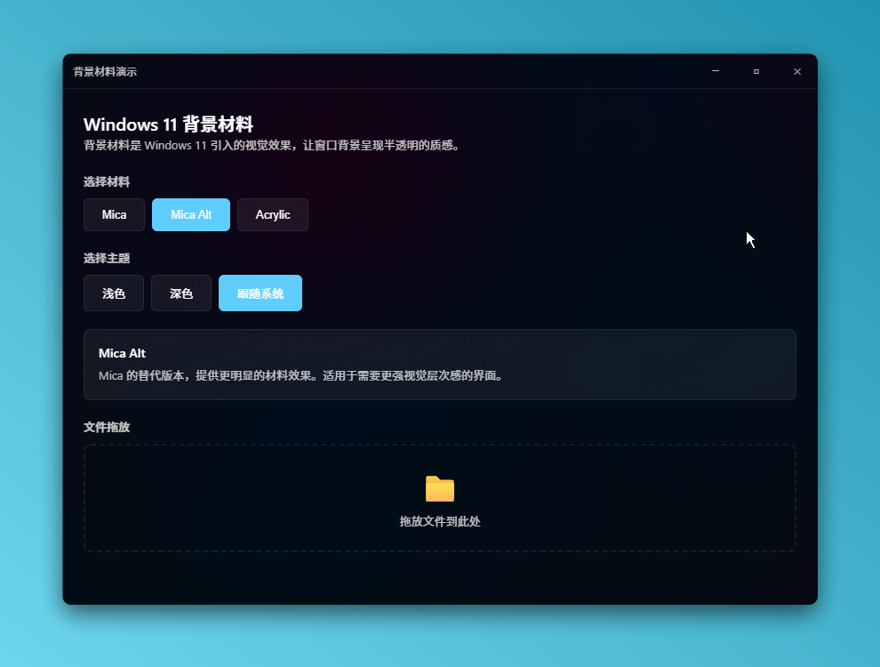
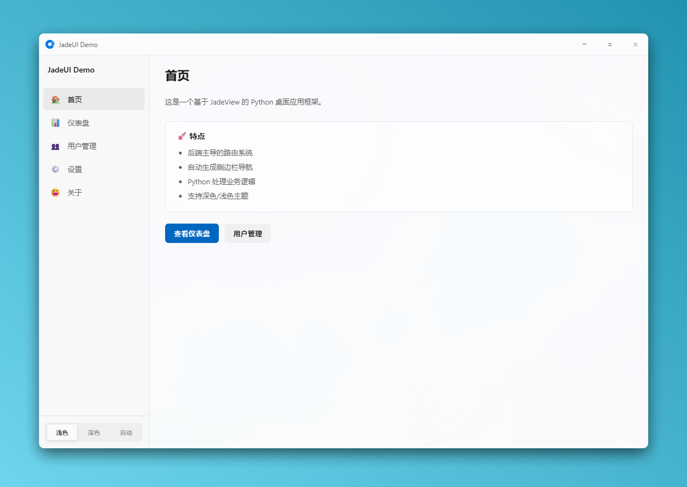
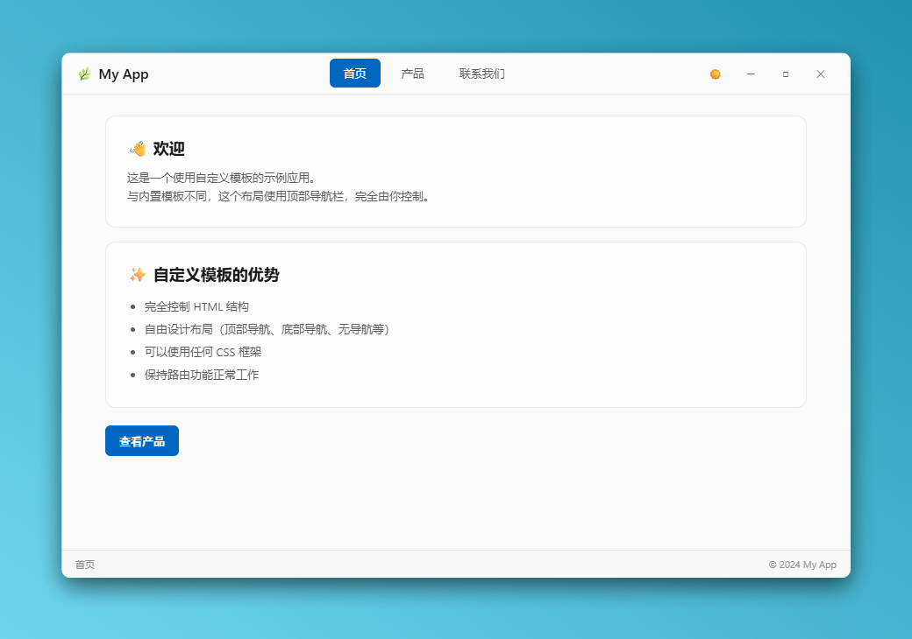
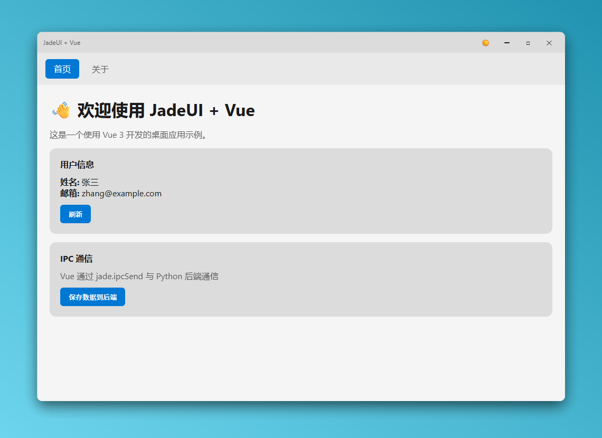

# JadeUI

<p align="center">
  <strong>Python SDK for JadeView - Create desktop applications with WebView</strong>
</p>

<p align="center">
  <a href="https://pypi.org/project/jadeui/"></a>
  <a href="https://pypi.org/project/jadeui/"></a>
</p>

---

JadeUI 是 [JadeView](https://jade.run) 的 Python SDK，让你可以使用 Python + Web 技术构建现代桌面应用程序。

## 特性

- **WebView 窗口** - 使用 HTML/CSS/JS 构建 UI
- **现代外观** - 支持 Windows 11 Mica/Acrylic 效果
- **主题切换** - Light/Dark/System 主题
- **IPC 通信** - Python 与前端双向通信
- **打包体积** - 极小的依赖，打包后体积仅有8MB左右

## 安装

```bash
pip install jadeui
```

## 快速开始

```python
from jadeui import JadeUIApp, Window

app = JadeUIApp()
app.initialize()  # 可选参数见下方

@app.on_ready
def on_ready():
    window = Window(
        title="Hello JadeUI",
        width=800,
        height=600,
        url="https://example.com"
    )
    window.show()

app.run()
```

### 初始化选项

```python
app.initialize(
    enable_dev_tools=True,      # 启用开发者工具 (F12)
    log_file="./app.log",       # 日志文件路径
    data_directory="./data",    # WebView 数据目录，否则在当前目录解压资源
)
```

## 完整示例

### 加载本地 HTML

```python
from jadeui import JadeUIApp, Window, LocalServer

app = JadeUIApp()
server = LocalServer()

@app.on_ready
def on_ready():
    url = server.start("./web", "myapp")
    
    window = Window(
        title="My App",
        width=1024,
        height=768,
        url=f"{url}/index.html",
        remove_titlebar=True,  # 无边框窗口
        transparent=True,
    )
    window.show()
    window.set_backdrop("mica")  # Windows 11 效果

app.run()
```

### IPC 通信

```python
from jadeui import JadeUIApp, Window, IPCManager

app = JadeUIApp()
ipc = IPCManager()

# 注册消息处理器
@ipc.on("message")
def handle_message(window_id, message):
    print(f"收到: {message}")
    ipc.send(window_id, "reply", f"Echo: {message}")
    return 1

@app.on_ready
def on_ready():
    Window(title="IPC Demo", url="...").show()

app.run()
```

**前端 JavaScript:**

```javascript
// 发送消息到 Python (使用 jade.ipcSend)
jade.ipcSend("message", "Hello from JS!");

// 接收 Python 消息 (使用 jade.ipcMain)
jade.ipcMain("reply", function(data) {
    console.log("Python replied:", data);
});
```

## 窗口选项

```python
window = Window(
    title="My App",
    width=1024,
    height=768,
    url="https://example.com",
    
    # 外观
    remove_titlebar=True,      # 移除标题栏
    transparent=True,          # 透明背景
    theme="Dark",              # Light/Dark/System
    
    # 大小限制
    min_width=800,
    min_height=600,
    max_width=1920,
    max_height=1080,
    resizable=True,
    
    # 位置
    x=100,                     # -1 为居中
    y=100,
    
    # 状态
    maximized=False,
    fullscreen=False,
    always_on_top=False,
    
    # WebView
    autoplay=False,
    disable_right_click=False,
    user_agent="Custom UA",
)
```

## 窗口方法

```python
# 显示/隐藏
window.show()
window.hide()
window.close()

# 状态
window.minimize()
window.maximize()
window.restore()
window.focus()
window.set_fullscreen(True)

# 属性
window.set_title("New Title")
window.set_size(1280, 720)
window.set_position(100, 100)
window.center()
window.set_always_on_top(True)

# 主题
window.set_theme("Dark")
window.set_backdrop("mica")  # none/mica/mica_alt/acrylic/tabbed

# WebView
window.load_url("https://example.com")
window.execute_js("console.log('Hello!')")

# 状态查询
window.is_visible
window.is_maximized
window.is_minimized
window.is_focused
```

## API 文档

完整文档请访问: https://jade.run/python-sdk

## 示例效果

### 计算器

简单的计算器示例，展示基本的窗口和 IPC 通信。


### Backdrop 效果

展示 Windows 11 Mica/Acrylic 背景效果。



### 路由示例

使用内置路由系统实现多页面应用。



### 自定义模板

自定义 CSS 样式的多页面应用示例。



### Vue 应用

使用 Vue.js 构建的现代前端应用示例。



> 更多示例请查看 [examples](./examples) 目录。

## 系统要求

- **操作系统**: Windows 10/11
- **Python**: 3.10+
- **依赖**: 无（纯 Python + DLL）

## 许可证

MIT License

## 链接

- [Python SDK 文档](https://jade.run/python-sdk)
- [JadeView 官网](https://jade.run)
- [GitHub](https://github.com/ArcletProject/jadeui)
- [PyPI](https://pypi.org/project/jadeui/)

